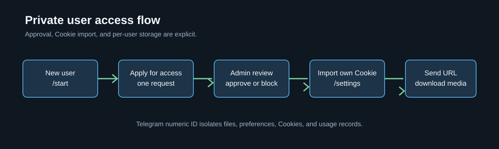
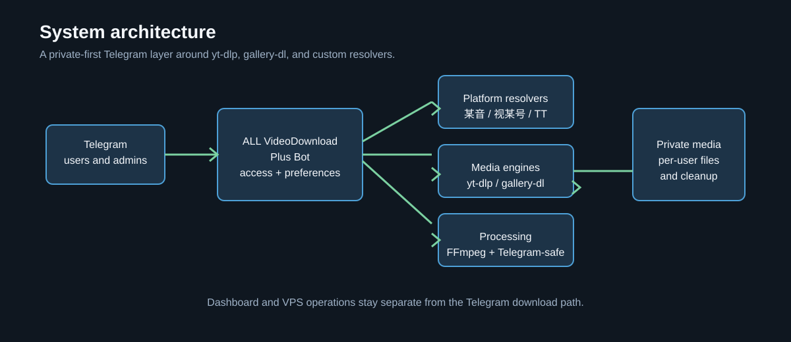
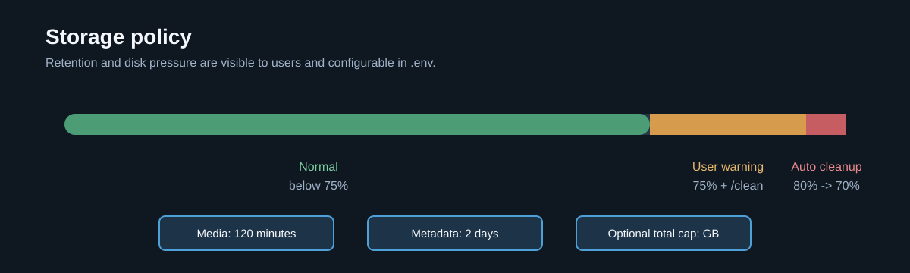
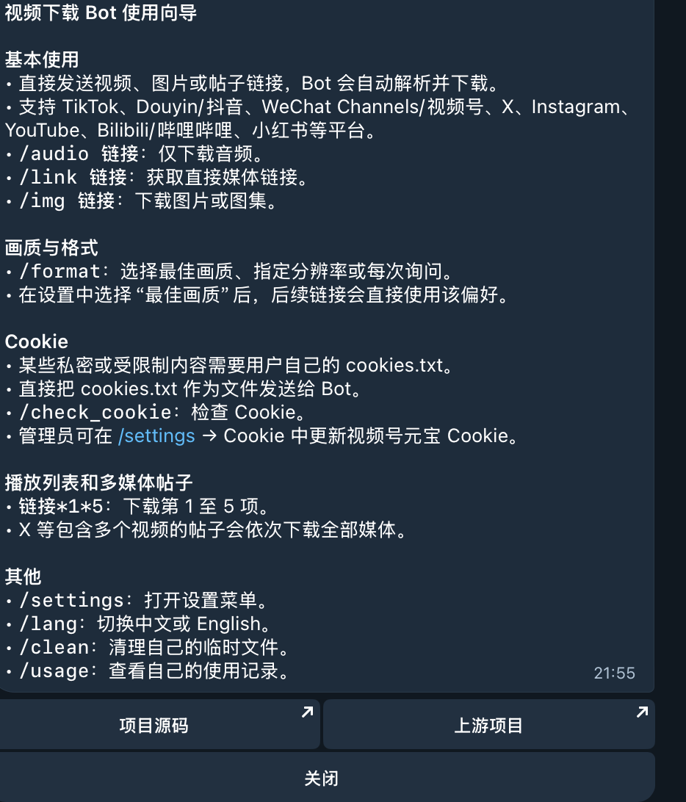
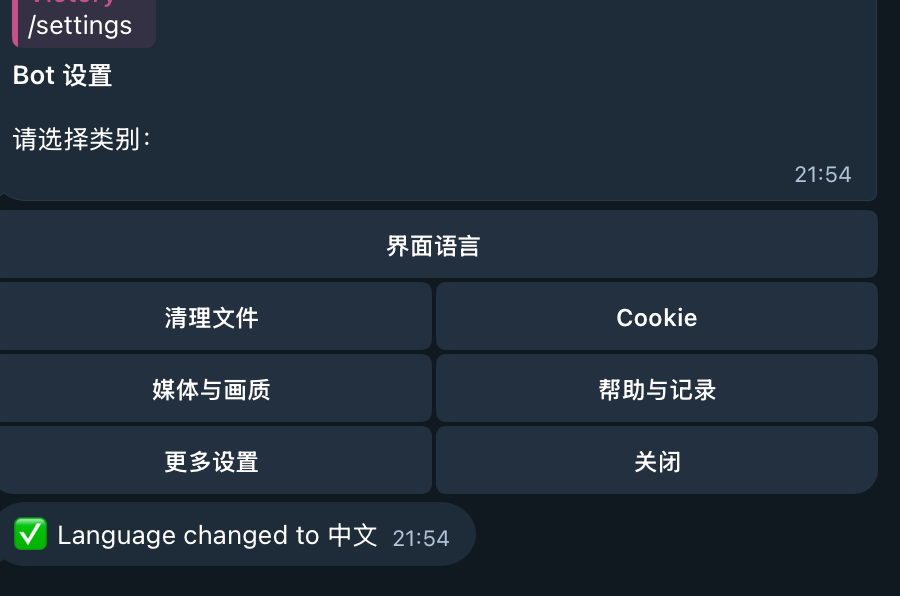
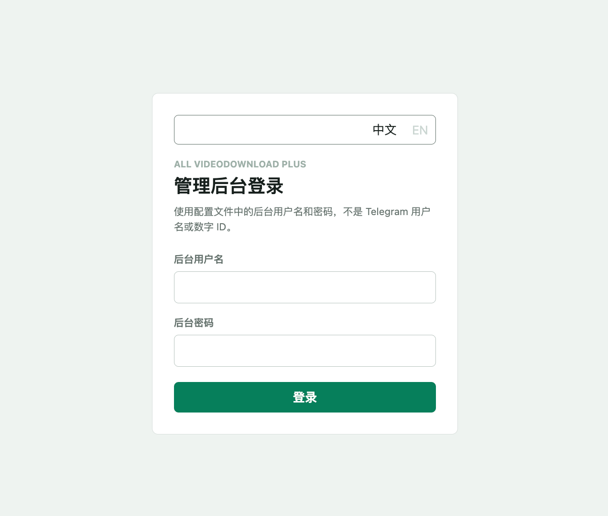
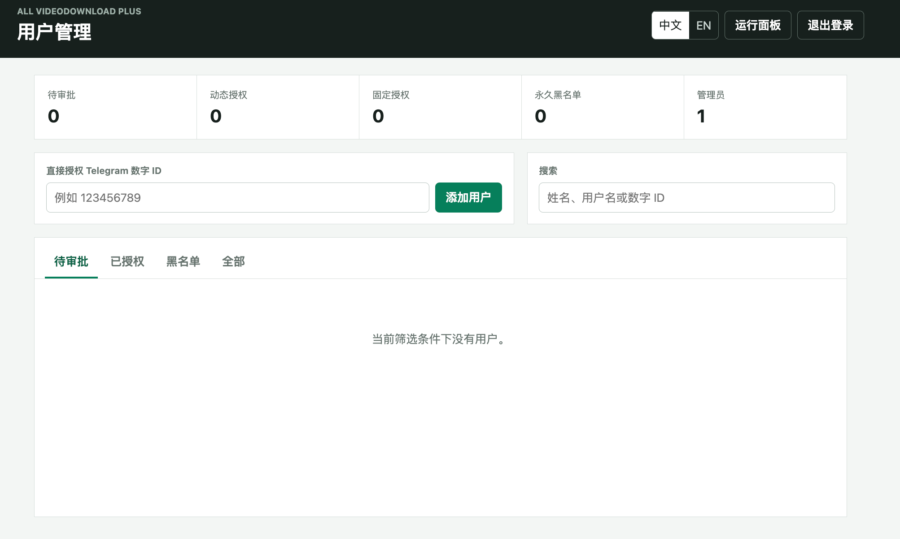

# ALL VideoDownload Plus

[](https://github.com/smthdagg/ALL-VideoDownload-Plus/releases)
[](LICENSE)
[](docs/DEPLOYMENT.zh-CN.md)
[](docs/DEPLOYMENT.zh-CN.md)

ALL VideoDownload Plus 是一个独立发布的 Telegram 多平台下载项目，不是上游项目的公开模板。它重点支持微信视频号、抖音、TikTok、Instagram、X、YouTube，同时兼容 Bilibili、小红书以及其他由 `yt-dlp` / `gallery-dl` 支持的平台。用户只需要把原始平台链接发给 Bot，Bot 就会自动解析、下载并回传媒体。

当前版本包含完整中英文 Bot Help 与命令菜单、用户申请/审批/永久拉黑、独立 Cookie 与用户偏好、X 多视频帖子、视频号元宝解析、TikTok 音视频兼容与重试、抖音解析、带认证的 Web 管理后台、自动清理、watchdog 自愈以及可复现的 VPS 迁移备份。







### Bot 界面预览

中文 Help 将常用下载、Cookie 导入、画质、播放列表、清理和语言切换集中在一个面板中，方便新用户直接开始使用。



### 设置与后台界面预览

以下界面图展示 Bot 设置菜单、中文 / English 切换、独立的 Web 后台登录，以及用户申请审批管理。Web 后台账号密码与 Telegram 数字 ID 完全独立。







## 当前版本范围

- **Bot 使用体验：**中英文 Help、Telegram 本地化命令菜单、`/lang`、`/settings`、画质预设、Cookie 工具和平台专项向导。
- **平台能力：**TikTok 有界重试与 Telegram 音视频兼容格式、X 多视频帖子、抖音移动端/API fallback、视频号公开接口与 Yuanbao 解析、Instagram 图集处理。
- **私人部署能力：**用户申请、频率限制、审批、永久拉黑、用户隔离、认证后台、日志查看、磁盘清理、watchdog 自愈和迁移备份。
- **维护方式：**自研行为统一保存在受 Git 跟踪的补丁脚本和模板中，上游生成代码可重复生成，运行时私密数据不会进入 GitHub。

本项目不是从零重写下载器，而是以
[`upekshaip/tg-ytdlp-bot`](https://github.com/upekshaip/tg-ytdlp-bot)
作为下载引擎依赖，再独立维护产品配置、补丁层、中文平台适配、权限管理、Cookie 工具、部署脚本、测试和文档。上游 bot 负责 Telegram、`yt-dlp`、`gallery-dl`、上传、格式选择等底层能力；本项目负责私有化部署、抖音/视频号增强、TikTok Telegram 兼容、VPS 运维和安全默认值。这个项目属于“半原创”：成熟下载底座借鉴/复用上游开源项目，定制功能是在 Codex 协助下开发完成。

English documentation: [README.md](README.md).

## 支持的平台与链接类型

下面的“重点适配”表示本项目对该平台增加了专门代码或运行配置；“通用兼容”表示主要依赖上游 `yt-dlp` / `gallery-dl` 的解析器。平台改版、地区限制、登录验证、限流和 Cookie 过期都可能影响实际结果。

| 平台 | 常见链接或内容 | 当前能力 | 登录态 / 注意事项 |
| --- | --- | --- | --- |
| 微信视频号 / WeChat Channels | `weixin.qq.com/sph/...` | **重点适配**；公开链接解析、预览卡片识别、Yuanbao fallback。 | 公开接口只返回预览信息时，需要有效的 Tencent Yuanbao Cookie；Cookie 由管理员更新。 |
| 抖音 / Douyin | `v.douyin.com/...`、`douyin.com/...`、分享文案 | **重点适配**；分享文本提取、短链归一化、移动端页面解析、可选 API sidecar。 | 通常可不带 Cookie；风控或地区变化时可配置 Douyin Cookie / sidecar。 |
| TikTok | `www.tiktok.com/@user/video/...`、`vt.tiktok.com/...` | **重点适配**；视频下载、有限挑战重试、Telegram 兼容音视频格式。 | 某些地区或账号内容需要 TikTok Cookie；优先 H.264 + AAC + MP4，减少 Telegram 无声问题。 |
| Instagram | `instagram.com/p/...`、`/reel/...`、`/stories/...` | **重点适配**；视频、图片、Reels 和图集。 | 私密、登录可见或受限内容需要 Instagram Cookie；Story 还受账号权限影响。 |
| X / Twitter | `x.com/.../status/...`、`twitter.com/...` | **重点适配**；单视频、图片，以及同一帖子内多个视频。 | 受限帖子可能需要 X Cookie；多个媒体会按多项目任务处理。 |
| YouTube | `youtube.com/watch?v=...`、`youtu.be/...`、Shorts、播放列表 | **重点适配**；视频、音频、Shorts，使用 PO Token provider。 | 年龄限制、会员内容或地区限制可能需要 YouTube Cookie；播放列表会产生多个任务。 |
| 哔哩哔哩 / Bilibili | `bilibili.com/video/...`、`b23.tv/...` | **通用兼容**；视频、音频，具体清晰度由上游解析器决定。 | 大会员、登录可见或地区限制内容需要 Bilibili Cookie。 |
| 小红书 / Xiaohongshu | `xiaohongshu.com/explore/...`、分享短链 | **通用兼容**；笔记中的视频或图片，依赖上游解析能力。 | 登录可见笔记需要 Cookie；分享文案中的附加文字应保留完整链接。 |
| Facebook | `facebook.com/.../videos/...`、Reels | **通用兼容**；公开视频或可访问媒体。 | 私密、登录可见和部分 Reels 需要 Facebook Cookie。 |
| Vimeo | `vimeo.com/...` | **通用兼容**；公开视频。 | 私密、密码保护或嵌入限制视频通常无法直接解析，除非提供有效登录态。 |
| Reddit | `reddit.com/r/.../comments/...`、`v.redd.it/...` | **通用兼容**；帖子媒体和视频。 | 被删除、私密社区或地区受限内容无法下载；音视频可能需要合并。 |
| Twitch | `twitch.tv/videos/...`、Clip | **通用兼容**；公开视频或 Clip。 | 直播回放可用性受平台限制，订阅/地区内容需要对应登录态。 |
| 快手 / Kuaishou | 快手分享链接 | **实验性通用兼容**；是否成功取决于当前上游 extractor。 | 平台风控较强，可能需要 Cookie；不作为当前核心平台承诺。 |
| 音频 / 图集站点 | SoundCloud、Pinterest 等 | **通用兼容**；由 `yt-dlp` / `gallery-dl` 支持的媒体类型。 | 具体站点、内容类型和 Cookie 要求以解析器结果为准。 |

### 如何理解支持范围

- **重点适配平台**：微信视频号、抖音、TikTok、Instagram、X/Twitter、YouTube；项目有专门的解析、格式选择、重试或 Cookie 流程，并在本地/VPS 回归测试中优先验证。
- **通用兼容平台**：Bilibili、小红书、Facebook、Vimeo、Reddit、Twitch、快手和其他 `yt-dlp` / `gallery-dl` 站点。项目不会为每个上游站点维护独立破解逻辑，成功率随上游 extractor 和平台规则变化。
- **链接格式**：优先发送平台原始 URL 或完整分享文案；不要只发送失效的预览卡片、截图或已经过期的 CDN 直链。
- **Cookie 规则**：Cookie 是对应平台的登录态，不是通用 Cookie。管理员可以在 Bot 的 Cookie 菜单中更新；每个平台单独保存，绝不会上传到 GitHub 的公开发布包。
- **下载结果**：视频、音频、图片、图集和多视频帖子会按平台能力返回；Telegram 的文件大小、时长和格式限制仍然适用。

下载器无法保证永久支持所有平台。页面改版、登录要求、地区限制、限流、Cookie 过期和版权规则都可能导致某个平台暂时失败。

## 功能

- Telegram 内直接发送链接，bot 下载并回传视频。
- Bot 和 Web 后台均支持中文 / English：首次私聊会按 Telegram 客户端语言自动选择，也可随时发送 `/lang` 手动切换；登录页、运行面板、用户管理、按钮、常见错误和使用向导会同步切换。
- 主要支持 TikTok、抖音、微信视频号 / WeChat Channels、YouTube、Instagram、X/Twitter、Bilibili、小红书，以及大量 `yt-dlp` / `gallery-dl` 支持的网站。
- 默认私有使用：
  - 只有 `ADMIN` 和 `PRIVATE_ALLOWED_USERS` 可以私聊使用；
  - 群组默认关闭，除非显式加入 `ALLOWED_GROUP`。
- 本地 Docker 测试，确认无误后部署到 VPS。
- VPS Docker Compose 常驻运行。
- Dashboard 默认只绑定 `127.0.0.1`，建议通过 SSH tunnel 查看，不直接暴露公网。
- 抖音增强：
  - 支持抖音分享文案、短链、`iesdouyin` 链接归一化；
  - 优先从移动端页面数据解析无水印直链；
  - 可选接入 `Evil0ctal/Douyin_TikTok_Download_API` sidecar；
  - 可选接入远程解析接口。
- 视频号增强：
  - 支持 `https://weixin.qq.com/sph/...`；
  - 可选使用 Yuanbao cookie 解析只返回预览信息的链接。
- TikTok 兼容模式：
  - 优先选择 `H.264 + AAC + MP4`，避免 Telegram 播放无声或兼容异常。
  - TikTok JavaScript 挑战出现临时响应错误时，Bot 会进行有限次数的自动重试。
- 管理员可在 Telegram 里用 `/set_yuanbao_cookie` 更新 Yuanbao cookie。

## 相对上游修改了什么

上游 `tg-ytdlp-bot` 提供 Telegram bot、`yt-dlp` / `gallery-dl`、格式选择、上传流程和后台面板等核心能力。本项目保留上游作为下载底座，在此基础上做了面向个人私有部署的补丁和增强：

- **默认私有使用**：配置模板围绕个人或小范围使用设计，通过 `ADMIN`、`PRIVATE_ALLOWED_USERS` 控制私聊权限，群组默认不开放。
- **后台更安全**：Docker Compose 默认把 Dashboard 绑定到 `127.0.0.1:5555`，VPS 上建议用 SSH tunnel 打开，不直接暴露公网。
- **两层用户管理**：管理员可在 Bot 内完成审批、拒绝、授权、撤权和永久拉黑；Web 后台提供搜索、状态筛选、用户历史和更完整的操作界面。
- **完整双语界面**：Bot 消息、命令菜单、设置、下载状态、常见错误、Cookie 向导，以及 Web 登录页、运行面板和用户管理页均提供中文 / English；Web 会记住最近选择的语言。
- **抖音解析链路**：支持抖音分享文案、短链归一化；优先尝试移动端页面数据，再尝试可选的 `Evil0ctal/Douyin_TikTok_Download_API` sidecar、远程解析接口或 Reqable 抓包输出。
- **视频号解析**：增加 `weixin.qq.com/sph/...` 解析；公开页面只有预览信息时，可用 Yuanbao cookie 作为 fallback。
- **Telegram 内更新 cookie**：管理员可用 `/set_yuanbao_cookie`，直接在 Telegram 里回复 cookie 文件或 Cookie header 来更新元宝 cookie。
- **TikTok Telegram 兼容格式**：优先选 `H.264 + AAC + MP4`，避免某些 TikTok 视频上传成功但 Telegram 播放无声或兼容异常。
- **受支持的运行基线**：Docker 使用 Python 3.12、稳定版 `yt-dlp 2026.08.19` 和 `bgutil-ytdlp-pot-provider 1.3.2`；已取消全局预发布依赖安装，并移除未使用的 MoviePy 1.x。
- **X/Twitter 多视频帖子**：一个 X/Twitter 帖子里如果有多个视频，补丁会探测全部 media entries，并按多视频任务下载，不再只取第一个。
- **公开安全打包**：`scripts/package-for-vps.sh` 默认排除真实配置、cookies、Telegram session、日志、下载文件和私有压缩包；只有显式 `--include-private` 才会生成个人迁移包。
- **VPS 自检循环**：`scripts/vps-watchdog.sh` 从系统层检查 Docker、app 容器、NTP 时间同步和 Pyrogram session；发现时间漂移或崩溃迹象时只重启 bot 服务。
- **自动磁盘保护**：`scripts/runtime-cleanup.sh` 会清理过期媒体和下载残片，同时保留用户设置、Cookie、日志和缓存。VPS 上每 30 分钟运行一次，当磁盘使用率超过 80% 时会优先删除最旧的可清理媒体文件。
- **补丁化维护上游**：自定义修改集中在 `scripts/apply-private-hardening.py` 和 `scripts/templates/`，以后重新 clone 上游 bot 后可以重复打补丁。
- **聚焦测试**：为自定义的抖音移动端解析、视频号解析保留了单元测试。

## 中文 / English 界面

- 新用户第一次私聊 Bot 时，会优先使用 Telegram 客户端上报的语言；中文地区使用中文，其他语言默认 English。
- 发送 `/lang` 打开语言按钮，或直接发送 `/lang zh`、`/lang en`。选择会按 Telegram 数字 ID 保存，重启后仍然有效。
- Telegram 的普通命令菜单和管理员命令菜单会分别注册中文与英文说明。
- Web 登录页、运行面板和 `/admin/users` 用户管理页右上角都有 `中文 / EN` 开关，并在浏览器中保存选择。
- 下载器底层返回的第三方原始错误可能包含网站或 `yt-dlp` 的英文技术字段；Bot 会在外层提供当前语言的可读错误说明，详细技术信息只保留在服务端日志中。

## 项目结构

本仓库不直接提交完整上游 bot。初始化时会把上游项目 clone 到：

```text
vendor/tg-ytdlp-bot
```

然后执行 `scripts/apply-private-hardening.py` 打补丁。

会提交到 GitHub 的内容：

- `scripts/`：初始化、打补丁、运行、打包脚本。
- `scripts/templates/`：自定义抖音/视频号解析模块。
- `deploy/config.local.py.example`：安全配置模板。
- `.env.example`：环境变量模板。
- `tests/`：自定义解析器测试。
- `docs/`：架构、部署、安全、来源说明。

不会提交的私密/运行时文件：

- `deploy/config.local.py`
- `deploy/cookies/*.txt`
- `vendor/tg-ytdlp-bot/.env`
- `vendor/tg-ytdlp-bot/magic.session`
- 下载文件、日志、缓存、打包压缩包。

## 环境要求

- Docker Engine 或 Docker Desktop
- Docker Compose v2
- Git
- Python 3（用于补丁脚本和测试）
- 具备足够磁盘空间的 Linux VPS（用于 24 小时运行）

## 本地 Docker 安装

依赖：

- Docker
- Docker Compose v2
- Python 3
- Git

步骤：

```bash
git clone https://github.com/smthdagg/ALL-VideoDownload-Plus.git
cd ALL-VideoDownload-Plus
cp .env.example .env
scripts/init-local.sh
```

第一次运行会创建：

```text
deploy/config.local.py
```

填入以下信息：

- `BOT_NAME`
- `BOT_NAME_FOR_USERS`
- `ADMIN`
- `API_ID`
- `API_HASH`
- `BOT_TOKEN`
- `LOGS_ID`
- `DASHBOARD_PASSWORD`
- `DASHBOARD_PUBLIC_URL`（可选；只有 HTTPS 地址才会在 Bot 菜单显示 Web 后台按钮）

然后再次运行：

```bash
scripts/init-local.sh
scripts/local-up.sh
```

不要让本地和 VPS 同时运行同一个 Bot。两个 Telegram 会话可能造成重复响应或 Session 冲突。

Dashboard：

```text
http://localhost:5555
```

停止本地服务：

```bash
scripts/local-down.sh
```

查看日志：

```bash
scripts/logs.sh
```

## VPS 部署

VPS 需要先安装 Docker 和 Docker Compose。

### 方式一：VPS 上直接 clone

```bash
git clone https://github.com/smthdagg/ALL-VideoDownload-Plus.git /opt/video-download-bot
cd /opt/video-download-bot
cp .env.example .env
cp deploy/config.local.py.example deploy/config.local.py
```

填写 `deploy/config.local.py` 后：

```bash
scripts/init-local.sh
scripts/local-up.sh
```

### 方式二：本地打包后上传

默认生成不含私密信息的公开安全包：

```bash
scripts/package-for-vps.sh
```

底层私有迁移包会包含配置、Cookie、Session、动态用户权限和用户偏好，可显式使用：

```bash
scripts/package-for-vps.sh --include-private
```

注意：`--include-private` 生成的包必须私密保存，不能上传 GitHub。

从正在运行的 VPS 生成一致的迁移包时，应使用会短暂停止并自动恢复 Bot 容器的封装脚本：

```bash
sudo scripts/prepare-vps-migration.sh
```

完整传输、恢复、验收和回滚步骤见
[中文部署与迁移手册](docs/DEPLOYMENT.zh-CN.md)。

上传并启动（以下示例使用 SSH 端口 `2222`）：

```bash
scp -P 2222 video-download-bot-vps.tar.gz root@YOUR_VPS:/opt/
ssh -p 2222 root@YOUR_VPS
mkdir -p /opt/video-download-bot
tar -xzf /opt/video-download-bot-vps.tar.gz -C /opt/video-download-bot --strip-components=1
cd /opt/video-download-bot
scripts/init-local.sh
scripts/local-up.sh
```

Dashboard 建议通过 SSH tunnel 打开：

```bash
ssh -p 2222 -L 5555:127.0.0.1:5555 root@YOUR_VPS
```

然后浏览器访问：

```text
http://localhost:5555
```

如果 VPS 的 443 端口已经被其他服务占用，可以使用 Caddy 的 8443
端口，并明确传入该部署自己的后台域名：

```bash
cd /opt/video-download-bot
DASHBOARD_DOMAIN=bot-admin.example.com scripts/configure-vps-dashboard.sh
```

脚本会先备份 Compose 文件、Caddy 配置和私有后台配置，再应用域名配置。

### VPS 自检循环

VPS 24 小时运行时，建议安装系统级 watchdog。它每分钟从外部检查 Docker、app 容器、系统时间同步，以及 Telegram Pyrogram session 是否真的启动。遇到 Telegram 时间漂移、近期 Python/Telegram 崩溃、容器停止等情况时，只重启 `app` 服务，不会重启整台 VPS。

使用一个命令同时安装 watchdog 和磁盘清理定时器：

```bash
sudo scripts/install-vps-operations.sh
```

### 自动清理与磁盘保护

VPS 安装脚本还提供了磁盘清理定时器，每 30 分钟运行一次。默认只保留媒体文件约 120 分钟，字幕等元数据保留 2 天；这些值可通过 `.env` 中的 `MEDIA_RETENTION_MINUTES` 和 `METADATA_RETENTION_DAYS` 调整。系统会保留每个用户的设置、Cookie、日志和权限记录。

Bot 会在磁盘达到默认 75% 预警线时，向使用 Bot 的私聊用户提示剩余空间和 `/clean` 清理命令；同一用户最多每 6 小时收到一次提醒。达到 80% 时，VPS 清理任务会按文件时间删除最旧的可清理媒体，直到降到 70% 以下。可用 `MAX_MEDIA_STORAGE_GB` 为所有用户媒体设置额外总容量上限，设为 `0` 表示仅使用磁盘百分比保护。

```bash
bash scripts/install-runtime-cleanup.sh
systemctl status video-download-runtime-cleanup.timer --no-pager -l
journalctl -u video-download-runtime-cleanup.service -n 50 --no-pager
```

Web 后台的“清理用户文件”现在会根据实际应用目录工作，不再使用旧的硬编码路径。Docker 各服务日志限制为每个文件 100 MB，最多保留 3 个轮转文件。

宿主机专属操作会明确显示边界：重启服务、WireGuard 切换 IP、引擎升级和列表刷新需要在 VPS 主机上执行，不会在 app 容器内假装成功。用户审批、拉黑、历史记录、配置编辑、清理、系统指标和域名列表编辑仍可在登录后的后台使用。

```bash
sudo install -m 0755 scripts/vps-watchdog.sh /usr/local/bin/video-download-watchdog

sudo tee /etc/systemd/system/video-download-watchdog.service >/dev/null <<'EOF'
[Unit]
Description=ALL VideoDownload Plus watchdog
Wants=docker.service
After=docker.service network-online.target

[Service]
Type=oneshot
Environment=APP_DIR=/opt/video-download-bot/vendor/tg-ytdlp-bot
Environment=APP_SERVICE=app
Environment=LOG_FILE=/var/log/video-download-watchdog.log
ExecStart=/usr/local/bin/video-download-watchdog
EOF

sudo tee /etc/systemd/system/video-download-watchdog.timer >/dev/null <<'EOF'
[Unit]
Description=Run ALL VideoDownload Plus watchdog every minute

[Timer]
OnBootSec=2min
OnUnitActiveSec=1min
AccuracySec=10s
Persistent=true
Unit=video-download-watchdog.service

[Install]
WantedBy=timers.target
EOF

sudo systemctl daemon-reload
sudo systemctl enable --now video-download-watchdog.timer
```

查看状态：

```bash
systemctl list-timers --all video-download-watchdog.timer
systemctl status video-download-watchdog.service --no-pager -l
tail -f /var/log/video-download-watchdog.log
```

## Cookie 配置

可选 cookie 文件放在：

```text
deploy/cookies/youtube.txt
deploy/cookies/instagram.txt
deploy/cookies/tiktok.txt
deploy/cookies/twitter.txt
deploy/cookies/facebook.txt
deploy/cookies/vk.txt
deploy/cookies/douyin.txt
```

默认使用 Netscape cookies.txt 格式。

视频号 Yuanbao fallback 可在 `scripts/init-local.sh` 生成的运行时环境文件里配置：

```env
WECHAT_CHANNELS_YUANBAO_COOKIE=
WECHAT_CHANNELS_TIMEOUT=30
```

也可以用管理员账号在 Telegram 里发送 `/set_yuanbao_cookie`，回复 cookie 文件或 Cookie header，即可运行时更新。

### 抖音 Cookie 更新

抖音很多链接可以不依赖本人 cookie，但抖音风控变化比较频繁，保持一个新的 cookie 可以提高解析成功率。

支持两种格式：

- 浏览器导出的 Netscape `cookies.txt`；
- 原始请求头，例如 `Cookie: name=value; name2=value2`。

更新步骤：

1. 浏览器打开 <https://www.douyin.com/> 并登录。
2. 导出 Douyin cookies.txt，或在开发者工具 Network / 网络里复制 `douyin.com` 请求的 `Cookie` header。
3. 保存到：

   ```text
   deploy/cookies/douyin.txt
   ```

4. 重新执行初始化，让脚本同步到可选的 Douyin sidecar 配置：

   ```bash
   scripts/init-local.sh
   scripts/local-up.sh
   ```

如果是在 VPS 上，进入部署目录后执行同样命令，例如：

```bash
cd /opt/video-download-bot
scripts/init-local.sh
scripts/local-up.sh
```

注意：

- `deploy/cookies/douyin.txt` 已被 Git 忽略，不会上传 GitHub。
- `scripts/package-for-vps.sh` 默认不会打包这个 cookie。
- 只有使用 `--include-private` 时才会包含真实 cookie，所以这个私有迁移包必须自己保存。

### 视频号 Yuanbao Cookie 获取

部分视频号链接的公开页面 `weixin.qq.com/sph/...` 只返回预览信息，这时项目可以选择使用已登录的腾讯元宝网页 cookie 作为 fallback。

元宝入口：

- 当前网页应用及登录入口：<https://yuanbao.tencent.com/>
- 原来的 `/chat/` 地址现在会跳转到网页应用首页。

推荐步骤：

1. 用浏览器打开 <https://yuanbao.tencent.com/> 并登录。
2. 打开浏览器开发者工具，然后刷新页面。
3. 在 Network / 网络里找到一个已登录状态下发往 `yuanbao.tencent.com` 的请求。
4. 复制请求里的 `Cookie` header，或者导出 cookie 文件。
5. 用管理员账号打开 `/settings` -> Cookies -> `更新视频号元宝 Cookie`，也可以从 Telegram 命令菜单选择 `/set_yuanbao_cookie`。
6. Cookie 较短时可以直接跟在命令后面；Cookie 很长或使用文件时，先发送 Cookie 消息或上传文件，再回复该消息发送 `/set_yuanbao_cookie`。
7. 不记得步骤时，直接发送不带参数的 `/set_yuanbao_cookie`；Bot 会按当前界面语言返回完整获取与更新向导。

元宝 Cookie 菜单只为管理员聊天注册，普通用户看不到这个专用命令，也无法调用更新功能。

如果元宝请求返回 HTTP `401`，表示保存的 cookie 已经过期或被拒绝，需要重新登录并按上述步骤更新。元宝可能调整内部接口地址，因此应从当前网页应用获取 cookie，不要依赖旧教程中的固定接口。

手动更新方式：

1. 打开 `vendor/tg-ytdlp-bot/.env`。
2. 把复制到的 Cookie header 填到 `WECHAT_CHANNELS_YUANBAO_COOKIE=` 后面。
3. 重启 bot：

   ```bash
   scripts/local-up.sh
   ```

这个 cookie 等同于你的登录态，请像密码一样保管。不要提交到 GitHub，不要贴到 issue，不要放进公开打包文件。

## 新用户申请、Cookie 与数据隔离

管理员可以直接在 Telegram 维护运行时白名单，不需要重启 Bot：

- `/users`：打开管理员用户管理菜单。
- `/add_user 123456789`：立即授权一个 Telegram 用户；Telegram 未隐藏发送者 ID 时，也可以回复对方原始消息或转发消息发送 `/add_user`。
- `/remove_user 123456789`：移除通过 Bot 动态添加的用户。
- `/list_users`：查看管理员、配置文件授权用户和动态授权用户。
- `/blacklist_user 123456789`：永久拉黑用户，立即撤销已有权限并删除待审批申请。
- `/unblacklist_user 123456789`：解除永久拉黑；解除后用户需要重新申请或由管理员手动添加。
- `/log 123456789`：管理员查看指定用户的下载记录。

Bot 内的管理操作根据 `ADMIN` 中的 Telegram 数字 ID 鉴权，不要求再次输入密码。发送 `/users` 可处理日常操作；如果配置了 `DASHBOARD_PUBLIC_URL`，菜单底部还会出现“打开 Web 管理后台”按钮。

Web 用户管理页位于 `/admin/users`，提供：

- 待审批、已授权、固定授权、管理员和永久黑名单的数量总览；
- 按状态筛选，并按姓名、Telegram 用户名或数字 ID 搜索；
- 直接添加用户、批准或拒绝申请、撤销动态权限、永久拉黑与解除拉黑；
- 查看单个用户最近 100 条下载历史；
- 管理员不能删除或拉黑；`PRIVATE_ALLOWED_USERS` 固定用户不能在网页删除，但可由永久黑名单临时覆盖。

Web 后台始终需要独立的 `DASHBOARD_USERNAME` 和 `DASHBOARD_PASSWORD`。Telegram 管理员身份不会自动登录网页，这是为了防止拿到管理员手机或转发链接的人直接进入后台。公网跳转必须先配置带 TLS 的反向代理，然后设置：

```python
DASHBOARD_PUBLIC_URL = "https://bot-admin.example.com"
```

不要填写 HTTP 地址、带用户名密码的 URL 或带查询参数的临时链接；这些地址不会被 Bot 接受。只通过 SSH tunnel 使用后台时请保持该值为空，此时 Bot 不显示 Web 跳转按钮。

写在 `PRIVATE_ALLOWED_USERS` 中的是固定配置用户，必须从 `deploy/config.local.py` 移除并重启。移除用户只会撤销访问权限，不会自动删除该用户过去的日志和服务器目录。

以下内容按 Telegram 用户 ID 隔离：私聊消息、回传媒体、临时下载文件、用户自己上传的 Cookie、格式/字幕偏好和 `/usage` 记录。平台公共解析 Cookie、元宝 Cookie、解析 sidecar 和公共元数据缓存仍由整个 Bot 服务共享。普通用户无法浏览其他人的文件或日志，管理员可以通过 `/log 用户ID` 查看指定用户记录。

新用户的实际流程如下：

1. 用户打开 Bot，选择语言后发送任意消息；未授权时会看到“申请使用权限”按钮，而不是收到模糊的无权限错误。
2. 用户点击一次申请按钮。Bot 会把姓名、用户名和 Telegram 数字 ID 发给管理员；重复点击不会重复创建申请或刷屏。
3. 管理员在 Bot 通知中点击“批准 / 拒绝 / 永久拉黑”，也可以在 Web 后台处理。批准立即生效，不需要重启服务。
4. 申请通过后，用户会收到完整使用向导：直接发送链接即可下载；需要登录态的平台，可打开 `/settings` 的 Cookie 菜单，或发送 `/cookies_from_browser` 按提示导入自己的 `cookies.txt`。
5. 每个平台 Cookie 独立保存到该用户的目录，只用于该 Telegram 数字 ID。其他用户看不到，也不会因为某个用户导入 Cookie 而共享登录态。Cookie 仍属于敏感登录凭证，请不要发到群组、GitHub 或公开聊天。
6. 普通拒绝后 24 小时内不能重复申请；永久拉黑会同时撤销权限、删除待审批记录，并隐藏申请入口。管理员可使用 `/unblacklist_user 用户ID` 恢复申请资格。

动态白名单保存在 `vendor/tg-ytdlp-bot/CONFIG/private_users.json`，公开安全打包会排除该文件，因为 Telegram 用户 ID 属于私人部署数据。

### 用户申请与管理员审批

分享下面的链接，把 `YOUR_BOT_USERNAME` 换成实际 Bot 用户名：

```text
https://t.me/YOUR_BOT_USERNAME?start=request_access
```

用户打开 Bot 并点击 Start。由于尚未授权，Bot 会显示“申请使用权限”按钮。用户点击后只会创建一条待审批记录，并把申请人的姓名、用户名和 Telegram 数字 ID 发送给所有管理员。

管理员可以在 Telegram 审批通知中点击“批准”“拒绝”或“永久拉黑”，也可以在 Web 用户管理页统一处理。批准后运行时白名单立即更新，申请人会收到包含 Cookie 导入和数据隔离说明的友好向导，无需重启。每个用户同时只能保留一条待审批申请，因此重复点击不会反复通知管理员；普通拒绝后 24 小时内不能再次提交。

永久拉黑的优先级高于动态白名单和配置文件授权：它会立即撤销已有权限、删除待审批申请，并且该账号以后看不到申请按钮。只有管理员使用 `/unblacklist_user 用户ID` 才能恢复其申请资格。待审批记录和永久黑名单都会显示在 `/users` 菜单中。

## 验证

```bash
python3 -m unittest discover -s tests
python3 -m py_compile scripts/apply-private-hardening.py
git status --ignored -s
```

## 来源和自研部分

见 [docs/CREDITS.md](docs/CREDITS.md)。

简要说明：

- 核心 bot 来自 `upekshaip/tg-ytdlp-bot`。
- 下载能力来自 `yt-dlp`、`gallery-dl`、`ffmpeg`。
- 可选抖音 sidecar 来自 `Evil0ctal/Douyin_TikTok_Download_API`。
- 本项目自研/半原创部分包括：部署封装、私有化安全默认值、抖音移动端解析、视频号/Yuanbao 解析、Telegram 更新 cookie 命令、TikTok Telegram 兼容格式策略、测试、文档和 VPS 运维流程；这些部分是在 Codex 协助下开发整理完成。

## 法律和安全提示

请只下载你拥有、获得授权，或法律允许保存的内容。请遵守平台条款、版权和当地法律。

不要提交真实 bot token、Telegram API、cookie、session 或私密打包文件。
