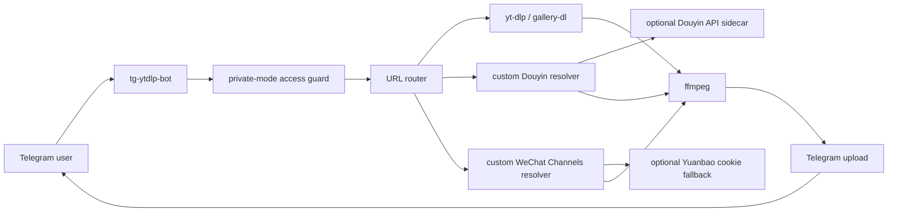

# Architecture

ALL VideoDownload Plus is an independent application release with a deployment
wrapper and patch layer around
[`upekshaip/tg-ytdlp-bot`](https://github.com/upekshaip/tg-ytdlp-bot).
The upstream project remains the Telegram bot engine. This repository keeps the
local operational pieces small, auditable, and private by default.

## Runtime Flow

## Services

The Docker Compose stack is generated inside `vendor/tg-ytdlp-bot` during
`scripts/init-local.sh`.

- `tg-ytdlp-bot`: Telegram bot runtime.
- `configuration-webserver`: local Caddy server that serves cookie files to the
  bot over the private Docker network.
- `bgutil-provider`: YouTube PO token helper used by the upstream bot.
- `douyin-api`: optional sidecar based on
  `Evil0ctal/Douyin_TikTok_Download_API`.

The dashboard is patched to bind to `127.0.0.1` by default. On a VPS, open it
through an SSH tunnel instead of exposing it to the public internet.

For a VPS that already uses host port 443, the supported public-dashboard
pattern is Caddy on host port 8443 with `reverse_proxy app:5555`; the example is
in `deploy/Caddyfile.dashboard.example`. The private `DASHBOARD_PUBLIC_URL`
must match the public HTTPS hostname and port so secure cookies and the Bot's
Web administration button are configured correctly.

## Patch Strategy

`scripts/apply-private-hardening.py` applies local changes after the upstream
bot is cloned or updated. The patch layer intentionally stays scriptable so the
project can keep receiving upstream fixes without committing the full vendor
tree.

Main patch areas:

- private-mode authorization for personal bot usage;
- dashboard binding and runtime safety defaults;
- custom Douyin direct-video resolution;
- custom WeChat Channels resolution and Yuanbao cookie fallback;
- Telegram admin command for updating Yuanbao cookies;
- TikTok H.264 + AAC MP4 preference and bounded challenge retries;
- Docker Compose sidecars for cookies, PO token helper, and optional Douyin API.
- private/public migration packaging with automatic source-service recovery.

## Private Files

The following files are runtime state and must not be committed:

- `deploy/config.local.py`
- `deploy/cookies/*.txt`
- `vendor/tg-ytdlp-bot/.env`
- `vendor/tg-ytdlp-bot/magic.session`
- generated archives, downloads, logs, and cache files.
